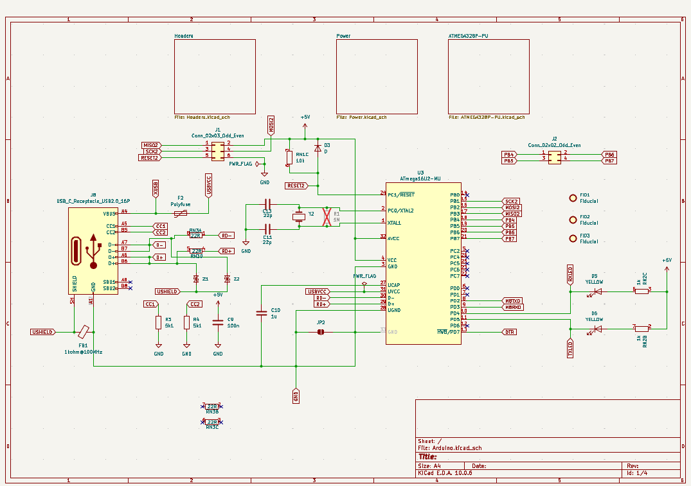
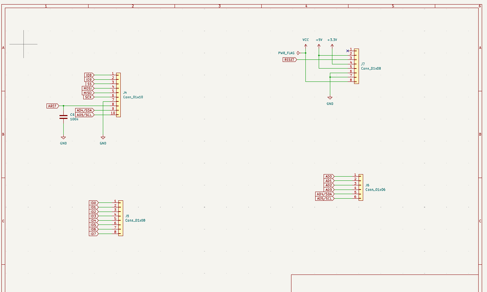
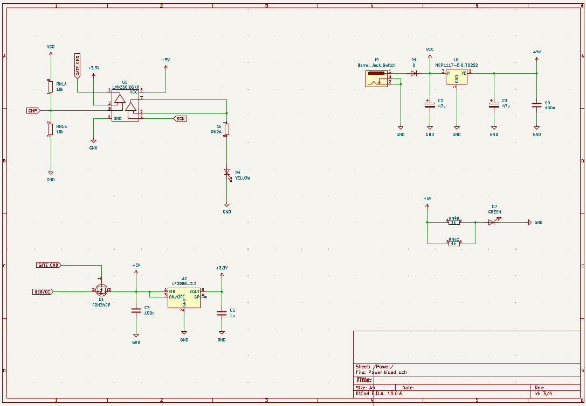
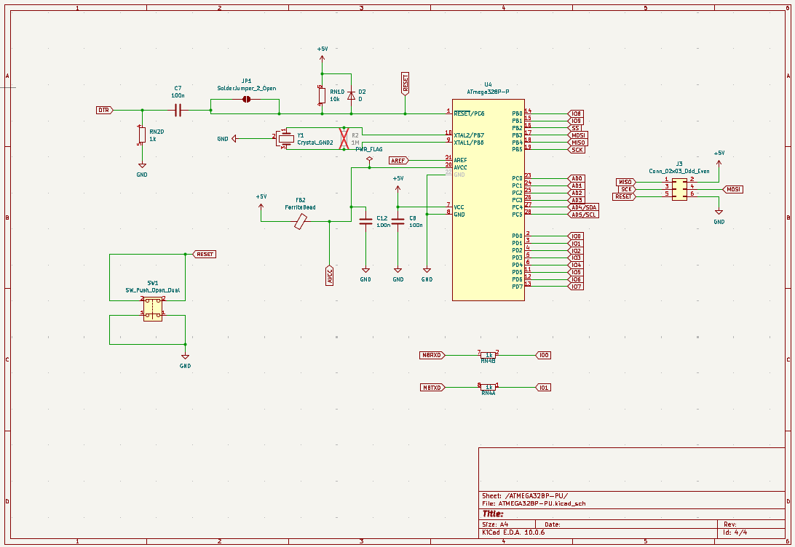
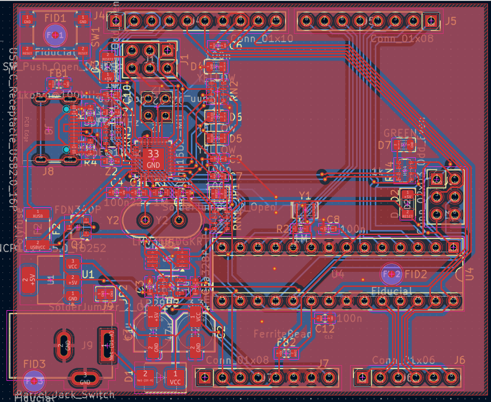
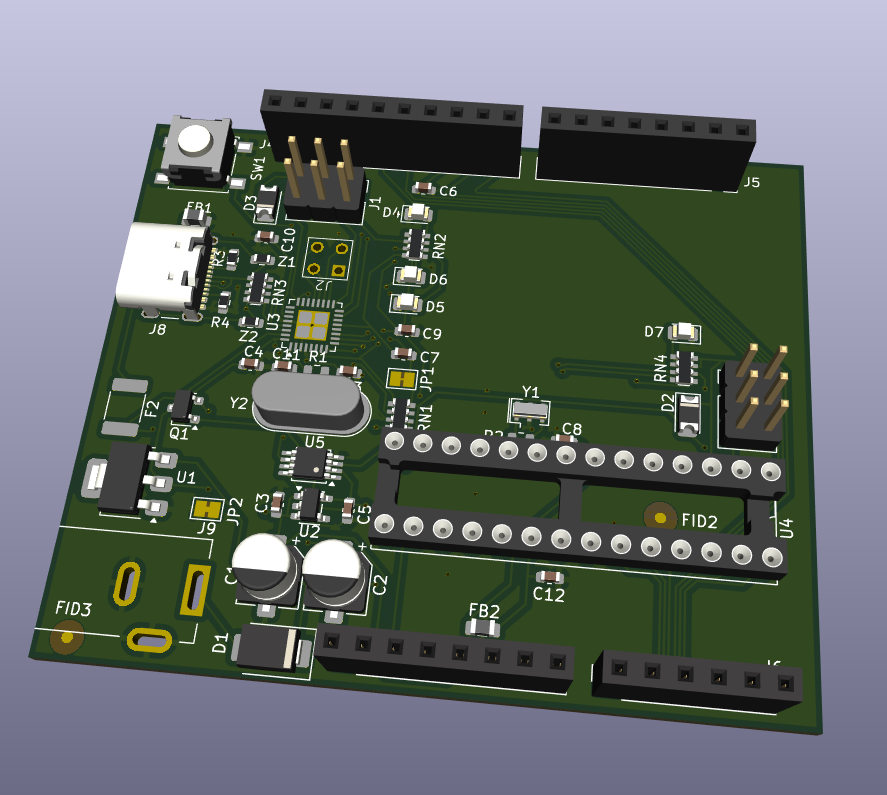

# Arduino-Uno-Compatible-PCB
Custom Arduino Uno-compatible PCB designed in KiCad, including schematic design, component footprint assignment, PCB layout, routing, and 3D visualization.

## Project Status
Completed

## Overview
This project involved designing an Arduino Uno-compatible printed circuit board(PCB) from the schematic stage through PCB layout and design-rule checking.
The design was created in KiCad and includes the major components and connections required for an Arduino Uno-compatible board.

## Tools Used
- KiCad
- PCB Editor
- Schematic Editor
- 3D Viewer

## Board Features
- ATmega328P microcontroller
- ATmega16U2 USB interface
- USB-C connector
- DC barrel jack input
- 5V and 3.3V voltage regulation
- Reset switch
- LEDs and indicator components
- Crystal oscillators
- ESD protection
- Resistor networks
- Through-hole and SMD components
- Front and back copper routing
- Ground copper zones

## Design Process
The PCB was developed through the following stages:
1. Schematic design
2. Electrical Rules Check(ERC)
3. Footprint assignment
4. PCB component placement
5. Board outline creation
6. Track routing
7. Via placement
8. Copper zone creation
9. Design Rules Check(DRC)
10. 3D visualization

## Current Result
The schematic and PCB layout have been completed and checked using KiCad's ERC and DRC tools.
The final design includes routed connections, vias, copper zones, and the complete board outline.

## Project Images
### Root Schematic

### Headers Schematic

### Power Schematic

### ATmega328P-PU Schematic

### PCB Layout

### 3D View

## What I Learned
- Schematic design and ERC checking
- Component footprint selection
- PCB component placement
- Routing on multiple copper layers
- Via placement
- Ground-plane/copper-zone creation
- PCB design-rule checking
- KiCad 3D visualization
